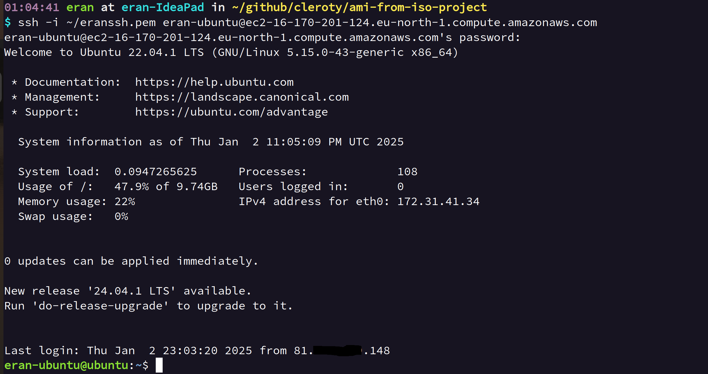

# AMI from ISO Project

This project converts an Ubuntu ISO file into an AWS AMI.

## Overview

This tool automates the process of uploading and then converting a raw disk image (or other formats which fit AWS prerequisites) to an AMI that can be used to launch EC2 instances and launch one ec2 instance with this AMI.

## Prerequisites

- QEMU or any VM software
- AWS CLI
- Terraform
- Ubuntu ISO file (version 22.04.1 recommended for the most updated ubuntu version *currently* supported)

## Steps

### 1. Install QEMU
```bash
sudo apt install -y qemu-utils qemu-system-x86
```
### 2. Create Virtual Disk Image
```bash
qemu-img create -f raw ubuntu-disk.img 10G
```

### 3. Create Virtual Machine
```bash
qemu-system-x86_64 -boot d -cdrom ubuntu-24.04.1-live-server-amd64.iso -drive file=ubuntu-disk.img,format=raw -m 2048
```
* Can also use VirtualBox for example and create ova with this command:
```bash
VBoxManage export eran-2204-ova (name of the vm) -o ubuntu-2204.ova (name for .ova)
```
### 4. Install Ubuntu OS
- Format the filesystem to ext4 (or ext3, ext2)
- Use Ubuntu kernel version 5.15.0 or earlier (Ubuntu 22.04.1)

> **Note**: The latest Ubuntu kernel supported for Linux VM to convert to AMI is 5.15.0. For more details, see [AWS VM Import/Export Prerequisites](https://docs.aws.amazon.com/vm-import/latest/userguide/prerequisites.html > Image formats supported by VM Import/Export).

### 5. Clone the repository
```bash
git clone https://github.com/eranzaksh/ami-from-iso-project.git
```

### 6. Run Conversion Script
Execute `convert_iso_to_ami.sh` with the following arguments:

1. Bucket name
2. AWS region
3. path/to/image.name
4. Format type
```bash
./convert_iso_to_ami.sh <bucket_name> <aws_region> <image_name> <format_type>
```
This script will:
- Create necessary IAM roles and policies
- Create an S3 bucket
- Upload the image
- Import the image and convert it to an AMI
- Use Terraform to launch an EC2 instance with the new AMI

### 7. Terraform Configuration

Terraform will:
- Create an EC2 instance using the new AMI
- Configure a security group allowing SSH access from the user pc's IP

Credentials for EC2 login:
- username: eran-ubuntu
- password: 123

> **Note**: AMI ID, region, and your IP are passed using `terraform.tfvars`. You can also specify a `key_name` for the SSH key pair.
 ### Print screen from the created AMI terminal
 